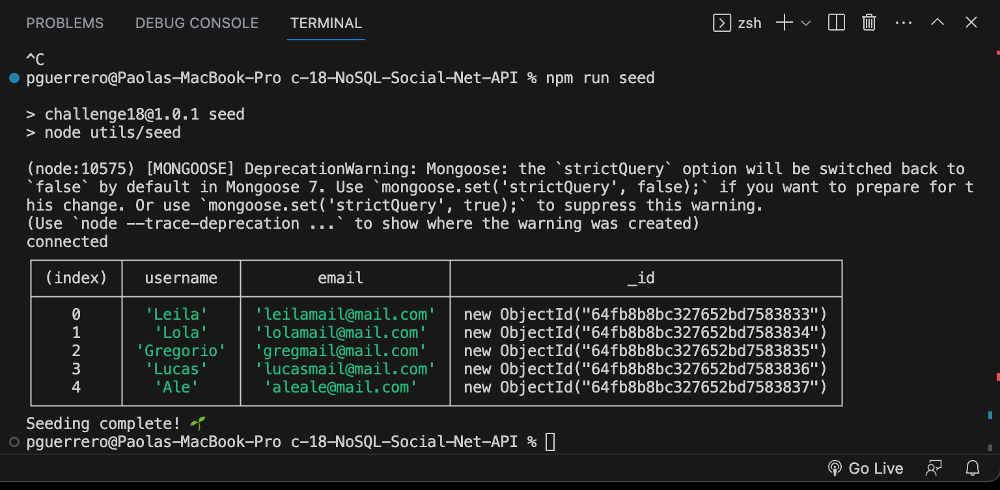
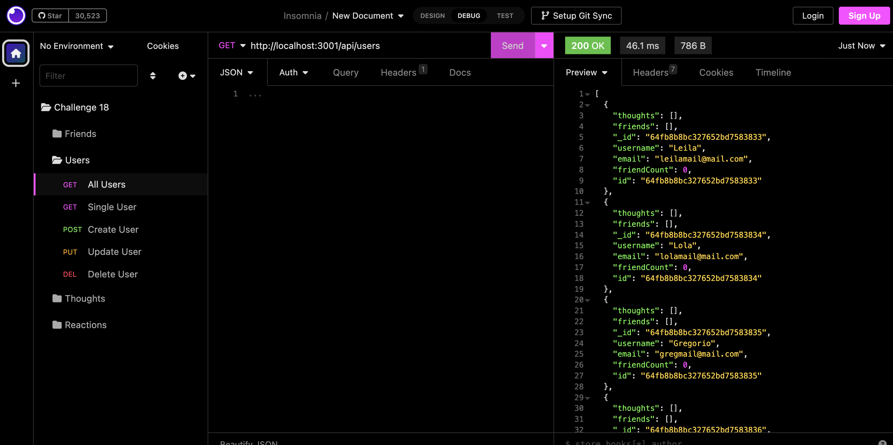
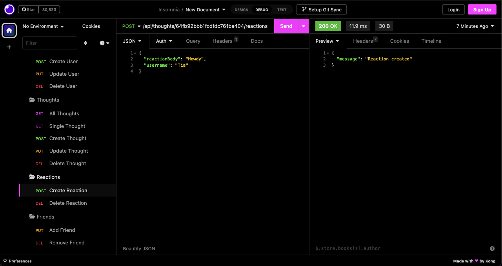
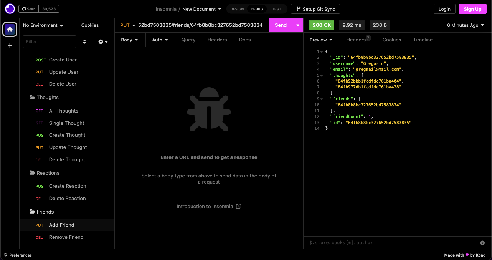
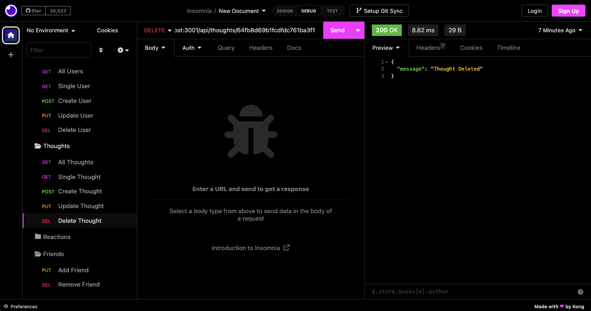

# c-18-NoSQL-Social-Net-API

## Description

I made this project to practice building an API that allows users to share their thoughts, reactions to friends’ thoughts, and create list of friends. I used Express.js for routing, Day.js to format my dates, a MongoDB database, and Mongoose ODM.

## Table of Contents

- [Installation](#installation)
- [Usage](#usage)
- [Credits](#credits)
- [License](#license)

## Installation

To be able to use this application users should clone the repo in a folder and open the application using their terminal. From the root directory of the application users must run “npm i” in their terminal which will install the dependencies needed to run this application.

### View Functionality:

[Video](https://drive.google.com/file/d/1LQ_HFEfqbhRCdsVYuqtnSu57jtupzZbY/view)

### Repo:

[My Repo](https://github.com/perfectblue0/c-18-NoSQL-Social-Net-API)

## Usage

I have provided seeded data of five users. To seed the database users must enter "npm run seed". Then users must enter “npm run start” on their terminal to run the application. Users can use Insomnia Core to create, update, view all, view a single, and delete users, thoughts, and reactions. Friends can be added and removed from users as well.

  

  

  

  

   
## Credits

I used code from the UC Berkley Fullstack Coding Bootcamp activities to create this project. I was able to complete this project using Kayvon Kazemi’s, TA at the bootcamp, challenge review video that covered how to get started on this challenge.

## License

Please refer to the repo.